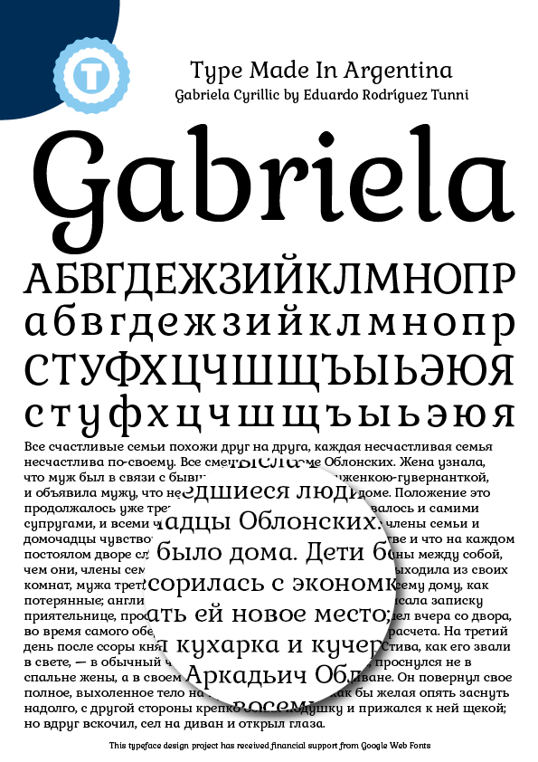

### Gabriela Font

by Eduardo Tunni

Gabriela is a serif typeface with soft shapes, and special terminal forms which are shaped like curls. They connect each letter to create attractive word shapes and text blocks with a fine texture. In small bodies of text she works well for reading, and in headlines provides interesting details to catch the eye.

### Changelog
- June 2013: support for Cyrillic.
- March 2023: expand language support / added comb accents / fixed some anchors position

### Copyright

Copyright 2013 The Gabriela Project Authors (https://github.com/etunni/Gabriela), with Reserved Font Name "Gabriela".

### License

This Font Software is licensed under the SIL Open Font License, Version 1.1.
This license is copied below, and is also available with a FAQ at:
https://scripts.sil.org/OFL

### Todo

* Add Vietnamese support
* Add GF Cyrillic Plus support

